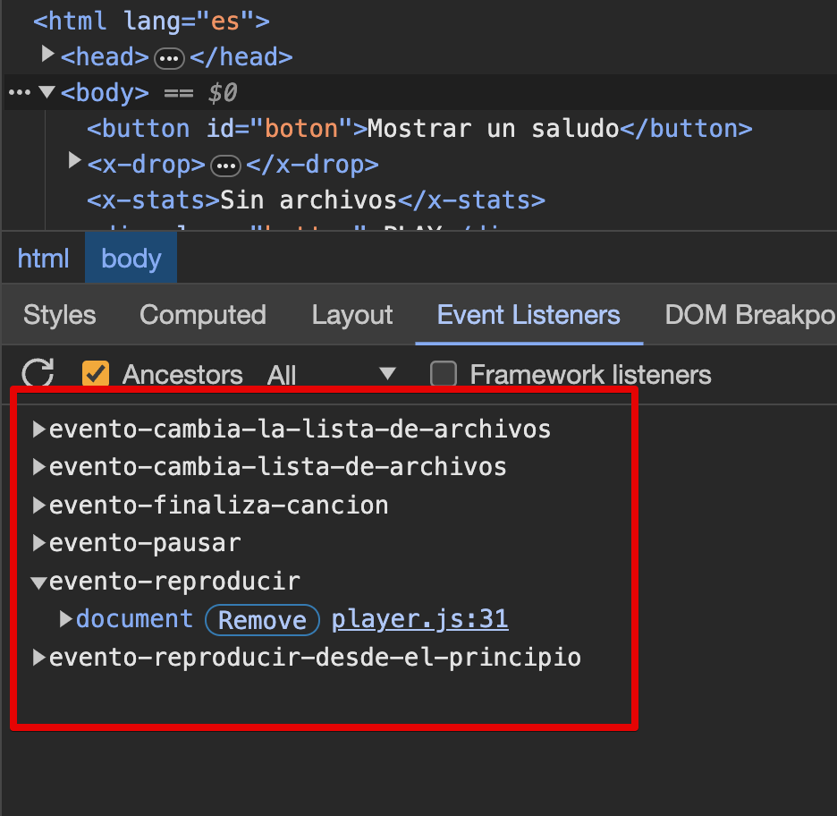

## ¿De qué se trata esto?

Este es un reproducir de audio inspirado en el clásico Winamp, lo
escribí muy artesanalmente y escribí un post sobre cómo
lo armé acá:

https://www.examplelab.com.ar/posts/2024-05-11-creando-retroplayer/


## Demostración

Puedes acceder a la aplicación usando este link:

- https://hugoruscitti.github.io/retroplayer/

Y si quieres instalar la aplicación tienes que pulsar este botón en
la barra de dirección del navegador:


## Instalación

Para iniciar el proyecto se tiene que iniciar un servidor
web y acceder al archivo index.html desde un navegador.


Para facilitar un poco las cosas durante el desarrollo se
puede usar un webserver que actualice el navegador
automáticamente como este:

```
pip install httpwatcher
httpwatcher
```

o bien:

```
npm install -g live-server
live-server
```

Las dos herramientas hacen lo mismo, muestran la aplicación
en un navegador y mantienen actualizado el contenido ante
cada cambio de archivo.

## ¿cómo funciona?

El código del proyecto está realizado con Vanilla JavaScript, así que lo
siguiente es una explicación de los componentes más importantes.

### Archivo principal: main.js

El único archivo JavaScript que carga el proyecto es "main.js", este archivo
funciona como archivo principal, así que es el punto de entrada del programa.
Este archivo carga todos los componentes y los registra. También es el archivo
encargado de cargar el estado inicial de los servicios.


### Depuración

Tener en cuenta que hay una variable global llamada "d" a la que se puede
acceder para ver el estado de los objetos principales durante el desarrollo.
Esta variable no se tiene que leer dentro del código, solamente está ahí para
que se puedan hacer pruebas durante el desarrollo en la consola del navegador.

### Bus

La comunicación de compontenes se hace a través de un objeto llamado Bus, que
está en el archivo "./js/bus.js".

Ahí vas a encontrar una lista con todos los eventos de la aplicación, no hay
otros manejadores de eventos en el software, todo pasa a través de este bus.

Ten en cuenta que los eventos se conectan al objeto "document", así que vas a
poder ver los eventos en acción abriendo el inspector del navegador y explorando
la sección de "Event Listeners":



Los eventos se conectan usando la forma "bus.conectar('nombre-del-evento'..."
así que también se puede buscar en el código.


Tener en cuenta que los nombres de eventos siempre comienzan con el prefijo
"evento-" para facilitar la búsqueda en el código.
